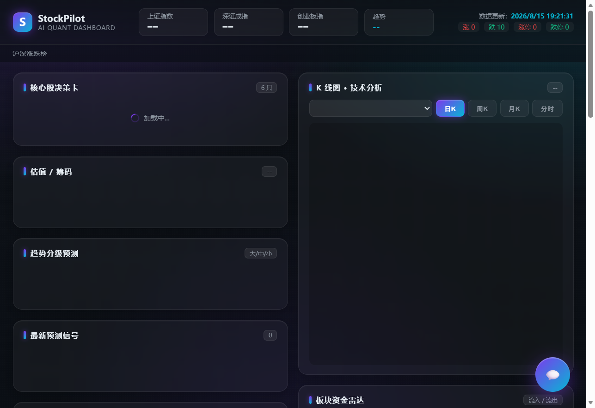
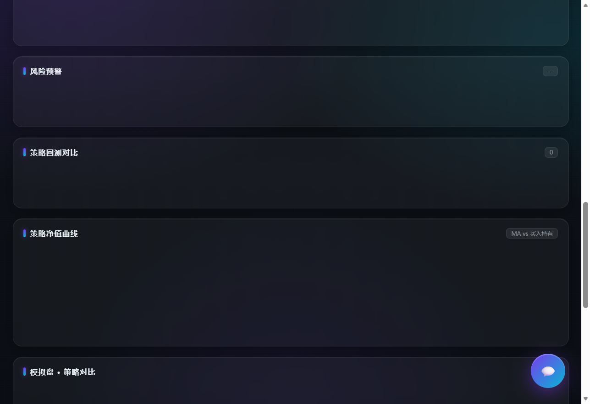

# 📈 StockPilot · AI 股票分析助手

> 全自动股票预测与决策系统——**数据全量 + AI 分析 + 自主运行——给判断，不给数据。**



**一句话**：输入自选股，StockPilot 每天自动跑完「数据 → 分析 → 预测 → 决策卡 → 微信推送」全流程，你只需要看结论。

---

## ✨ 核心能力

| 模块 | 说明 |
|---|---|
| 🧠 **决策卡** | 每只自选股明确"买入/持有/卖出/观望" + 仓位建议（ML + 基本面 + 估值 + 筹码 + 机构） |
| 🔮 **预测引擎** | 三源融合（ML 二分类 53.6% + LLM 新闻解读 + 趋势规则）——每日自动封存 + 验证 |
| 📊 **全资产覆盖** | A股全市场 + 港股 + 美股 + 期货 + 基金 + 可转债 + 黄金外汇 + 宏观 |
| 📈 **专业图表** | 分时/日K/周K/月K + BOLL/KDJ 指标 + 指数切换 |
| 💼 **持仓管理** | 输入持仓 → 实时盈亏/市值/风险预警/组合分析 |
| 🔄 **策略回测** | 10 策略验证（含滑点+手续费）——趋势家族 8/8 跑赢 |
| 💰 **模拟盘** | 3 策略回放 2024-2026（药明康德 +158.8%） |
| 🤖 **AI 聊天** | 19 种意图（个股分析/横向对比/组合体检/估值/筹码/研报/政策/事件日历...） |
| 🕐 **自主时钟** | 30 分钟新闻+政策+异动 / 每日预测+验证+推送（微信） |

---

## 📸 界面预览

| 决策看板（上半） | 决策看板（下半） |
|---|---|
|  |  |

---

## 🏗️ 技术架构

```
【数据层】SQLite 1088 万行（全A 5259 只 × 11年 + 财务/新闻/情绪/宏观）
【分析层】45+ 引擎模块（技术指标 30 个 / ML 分层模型 / LLM 分析师 / 多因子决策）
【服务层】Flask API（24 个端点——K线/决策/预测/持仓/板块...）
【展示层】深色 AI 金融看板（ECharts 图表 + 聊天悬浮框）
【自动化】10 个 cron（无人值守——新闻时钟/每日全链/微信推送）
```

---

## 🚀 快速开始

### 方式一：下载 Release（推荐——免环境）
从 [Releases](https://github.com/Camelliaasas/StockPilot/releases) 下载 `StockPilot.exe`（Windows），双击即用。

### 方式二：源码运行
```bash
# 1. 安装依赖（Python 3.11+）
pip install -r requirements.txt

# 2. 配置（可选——不配则降级运行：无 LLM 分析/深度研报）
cp .env.example .env   # 填 DEEPSEEK_API_KEY（可选）

# 3. 启动（自动建库 + 启动看板）
python webui.py        # → http://127.0.0.1:5521
```

---

## ⚠️ 免责声明

本项目仅供学习与研究，**不构成任何投资建议**。股市有风险，决策需谨慎。作者不对因使用本项目产生的任何投资损失负责。

---

## 📦 技术栈

Python · Flask · ECharts · SQLite · scikit-learn · DeepSeek LLM · Windows

**Star 一下支持我继续做下去 ⭐**
